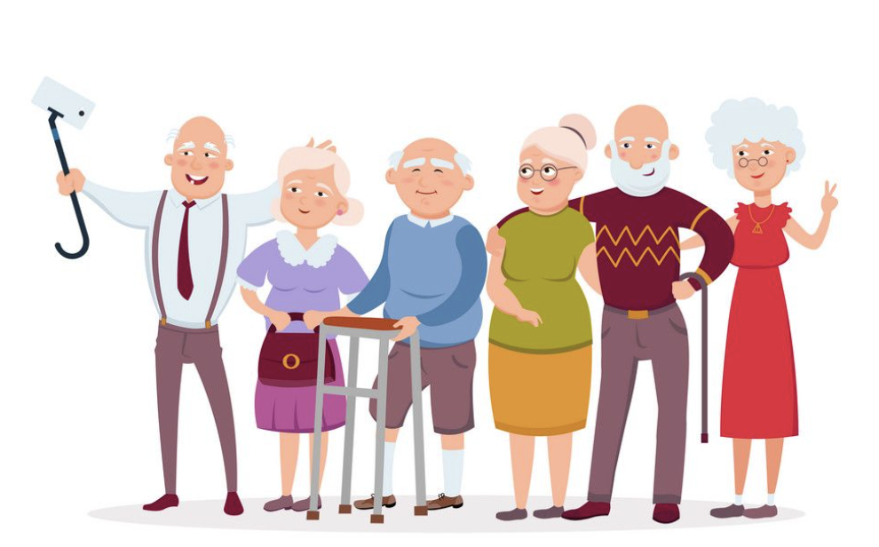

# RateMyOldAgeHome
- The problem:
  - Our elderly are some of the most vunerable people within our society and with a large retiring demographic in Canada and US we need to find ways to make sure they are being treated properly. 
  - Care takers are also not recongized and properly compenstated for the good work they do. They are underpaid and underappreciated.
- The vision: 
  - Help protect the elderly who are in senoir homes while recognizing 
  - Rewarding caretakers and recongizing who go out of the way to provide compassionate care. 
- The mission:
  - Build a web platform that allows users to rate old age homes as well as caretakers through www.ratemyoldagehome.com
- The work done here will be maintained and owned by the non profit.

# Project Links
- [Figma Designs](https://www.figma.com/file/7Wa4Wlfcp6ufqZO9n8Jng0/Rate-My-Retirement-Home?node-id=2%3A5814)

# Things to investigate 
- Ideas from call with Ben
  - [ ] Definition of success
  - [ ] Think about liability. What happens if the care taker is bad?
  - [ ] Think about focus. Personal support worker vs instuitions 

# Contributers 
- Special thanks is given to contributors who together work on this project with the goal of protecting our grandparents, neighbors, and friends.
- Frank Li
  - [Optional contact information]
  - [Optional headshot]
  - [Optional description or bio]
  - [Optional descrition of role]
- Henrik Hey
  - [Optional contact information]
  - [Optional headshot]
  - [Optional description or bio]
  - [Optional descrition of role]
- Julie Winner 
  - [Optional contact information]
  - [Optional headshot]
  - [Optional description or bio]
  - [Optional descrition of role]
- Shawn Peng
  - [Optional contact information]
  - [Optional headshot]
  - [Optional description or bio]
  - [Optional descrition of role]
- Boyang
  - [Optional contact information]
  - [Optional headshot]
  - [Optional description or bio]
  - [Optional descrition of role]
